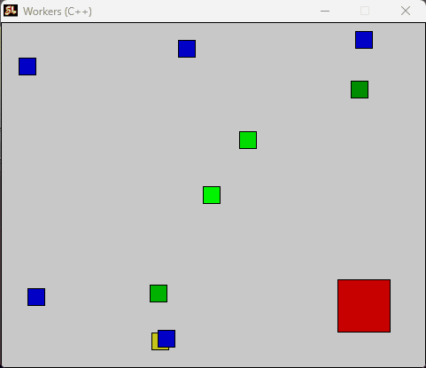

# 💡 **Workers**

This is a proof-of-concept app for the [Gatherers-Legacy](https://github.com/Broosky/Gatherers-Legacy) repo that I rediscovered on an old drive. I’m adding it here for sentimental value and to share the very early stages of the project!

---

## 🔹 **In Action**

---

## 🔹 **Key Features**

- **Early Concept**  
  A basic implementation of the resource gathering mechanic with minimal AI logic, much improved upon in **Gatherers-Legacy**.

- **Basic Traversal**  
  Implements programmatic destinations, using basic linear algebra to move units along paths.

---

## 🔹 **A Bit of History**

This app was one of the earliest experiments in the *Gatherers* series, built during my school reading week in 2010. Although it’s simple by today’s standards, it holds an important place in my development journey.
