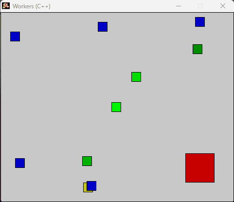

# 💡 Workers

This is a proof-of-concept app for the [Gatherers-Legacy](https://github.com/Broosky/Gatherers-Legacy) repo that I rediscovered on an old drive. I’m adding it here for sentimental value and to share the very early stages of the project!

> If you found this project useful, interesting, or worth keeping an eye on, consider giving it a ⭐️.
> It helps others discover the project and motivates me to keep building and sharing more.

## 🔹 In Action

## 🔹 Key Features

- **Early Concept**  
  A basic implementation of the resource gathering mechanic with minimal AI logic, much improved upon in **Gatherers-Legacy**.

- **Basic Traversal**  
  Implements programmatic destinations, using basic linear algebra to move units along paths.

## 🔹 A Bit of History

This app was one of the earliest experiments in the Gatherers series, built during my school reading week in 2010. Although it’s simple by today’s standards, it holds an important place in my development journey.

##

> Educational Use Notice: This project is provided for educational and learning purposes only. You are welcome to read, study, and experiment
> with this software and/or hardware. It is not intended for commercial use. This software and/or hardware is provided "as is", without warranty
> of any kind. The author assumes no responsibility for any damages or issues resulting from its use.